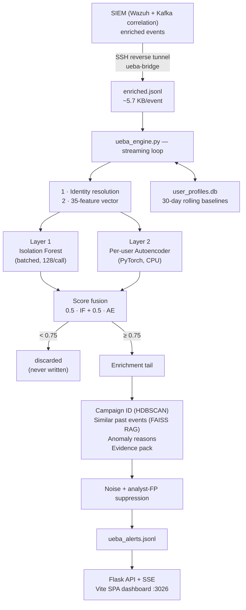

# CyberSentinel UEBA — Technical Guide

**User & Entity Behaviour Analytics engine**
Host: box 98 (`164.52.194.98`) · Base: `/root/NEW_DRIVE/aditya_ueba` · Dashboard: port `3026`
Document date: 2026-08-28

---

## 1. What this project does

Security tooling is good at catching **known-bad**: a signature fires, a rule matches, an
alert appears. It is much weaker against the case that matters most — a legitimate account,
using legitimate credentials, doing something that accountholder has never done before.
No rule is violated. Nothing is on a blocklist. The activity is suspicious only *relative to
that person's own history*.

UEBA closes that gap. It builds a rolling 30-day behavioural baseline for every user, host
and IP in the environment, then scores each incoming event against the baseline of the
entity that produced it.

**What it delivers**

- **Detection without signatures** — finds anomalies nobody wrote a rule for
- **Per-entity judgement** — the same event gets a different verdict depending on who did it
- **Volume reduction** — 937,000 events became 4,475 alerts (~0.5%) in the current soak
- **Incidents, not alert spam** — 50 alerts from one intrusion collapse into one campaign
- **Explained alerts** — every alert carries plain-English reasons and an evidence pack
- **A feedback loop** — marking a false positive silences that pattern on the next event

It sits **downstream of the SIEM** and consumes its enriched event stream. It does not
replace the SIEM's rule engine — it covers what a rule engine structurally cannot.

---

## 2. Features

### Detection

| Feature | What it gives you |
|---|---|
| **Per-entity behavioural baselining** | A rolling 30-day profile for every user, host and IP: typical hours, countries, agents, event volumes, average risk. 453 entities currently carry their own trained model. |
| **Dual-model scoring** | Two models that fail differently — an Isolation Forest for globally rare events, a per-entity autoencoder for personally out-of-character ones. Fused 50/50. |
| **Identity resolution** | Merges aliases of the same human (`RootSeeker`, `RootSeeker\Sujal`, an email form) into one identity so their history isn't fragmented across useless thin baselines. |
| **Graded verdicts** | `suspicious` / `anomalous` / `highly_anomalous` with a confidence level — not a binary flag. |
| **35 behavioural dimensions** | Temporal, geographic, rate, volume and anomaly signals, plus the entity's own deviation from norm. |

### Investigation and context

| Feature | What it gives you |
|---|---|
| **Campaign correlation** | HDBSCAN groups related anomalies every 15 minutes, so one intrusion arrives as one campaign an analyst triages once. |
| **Historical similarity search** | A FAISS search over ~5.6M past anomalies returns the 5 most similar prior cases — *"have we seen this before, and what was it?"* |
| **Plain-English reasons** | `impossible_travel`, `after_hours_activity`, `lateral_movement`, `data_exfiltration` and nine more, attached to each alert. |
| **Evidence pack** | Signature, the full raw event, the entity's baseline placed next to this event, and their history. |
| **AI Security Analyst** | Produces a written triage summary of any alert on demand, via Claude. |

### Analyst workflow

| Feature | What it gives you |
|---|---|
| **Live alert feed** | Server-sent events push each alert the instant it is scored — no refresh, no polling. |
| **Risk-ranked entities** | The 20 riskiest users and hosts, continuously reordered. |
| **Threat map** | Geolocated source activity. |
| **Endpoint coverage** | Per-agent health and event volume, so blind spots are visible. |
| **One-click false positive** | Mark an alert — or an entire campaign — as an FP. The engine honours it on the very next event, with no restart. |
| **Incident view** | Campaign-level triage rather than row-by-row. |

### Operations

| Feature | What it gives you |
|---|---|
| **Self-retraining** | Weekly GPU rebuild of both models, validated before swap-in, with automatic rollback to the previous models if the retrain fails. |
| **Crash-safe ingest** | Byte-offset resume — no gap and no duplication across restarts or rotations. |
| **Config-driven** | Every threshold, weight and suppression rule lives in one YAML file. Tuning needs no code change and no redeploy. |
| **Headroom** | Sustains 208 events/sec against an 89 events/sec feed — 2.3x. |

**What an analyst actually experiences:** an alert appears live → already grouped into its
campaign → with the reasons it fired and the evidence behind it → alongside the five most
similar past cases → and one click either escalates it or silences the pattern for good.

---

## 3. Architecture at a glance



---

## 4. How an event becomes an alert

### Step 1 — Ingest

`ueba-bridge.service` pulls enriched events from the SIEM over an SSH tunnel and appends them to `enriched.jsonl`. The engine tails that file from a saved byte offset (`.state/ueba.state`), reading in **1 MB chunks** and holding any trailing partial line until the next read. Restarts resume exactly where they stopped — no gap, no double-count.

### Step 2 — Identity resolution

Every event must be attributed to an entity before it can be compared to a baseline. Resolution order:

> real username → `ip:<source>` → `host:<name>` → `unknown`

An `identity_resolution` map in config merges aliases that are the same human — `RootSeeker`, `sujalthakur2003@outl` and `RootSeeker\Sujal` all collapse to one identity, so their history isn't split across three thin, useless baselines.

### Step 3 — Feature extraction

`ueba_preprocessor.py` turns the JSON event into a **35-dimensional float vector**:

| Group | Count | Features |
|---|---|---|
| Temporal | 5 | hour, day of week, is_weekend, is_business_hours, is_night_shift |
| Event flags | 4 | is_auth / is_network / is_file / is_process |
| Anomaly signals | 9 | brute_force, port_scan, tor, malicious_ip, impossible_travel, lateral_movement, data_exfiltration, after_hours, high_frequency |
| Rate counters | 4 | src_ip 5m, src_ip 1h, user 1h, host 1h |
| Behavioural | 3 | unique destinations 1h, unique ports 1h, recent failures 5m |
| Geo | 3 | distance_km, cross_border, cross_continent |
| Risk | 2 | enrichment risk_score, rule.level |
| Network intel | 1 | is_cloud_provider |
| Categorical (encoded) | 3 | event_category, event_outcome, traffic_direction |
| **Behavioural deviation** | 1 | how far this event sits from **that entity's** own 30-day baseline |

Missing fields fill to `0.0`. Feature 35 — the baseline deviation — is what makes this UEBA rather than generic anomaly detection.

### Step 4 — Score it twice

Two independent models, deliberately chosen to fail differently.

| | **Isolation Forest** | **Autoencoder** |
|---|---|---|
| Catches | Globally rare events | Personally out-of-character events |
| Method | 200 random trees; points that isolate in few splits are rare | 35→24→12→24→35 net learns to reconstruct *your* normal; poor reconstruction = unlike you |
| Trained on | Everyone, one global model | Per-entity (453 models on disk) with a global fallback |
| Params | contamination 0.005, 200 estimators | relu, dropout 0.1, threshold at 95th percentile |
| Runs on | CPU, **vectorised in batches of 128** | CPU (GPU left free for other tenants) |

Only the **100 most recently used** user autoencoders stay resident in memory; the rest load on demand.

### Step 5 — Fuse and decide

```
combined_score = 0.5 × isolation_forest + 0.5 × autoencoder
```

| Score | Verdict | Confidence |
|---|---|---|
| < 0.75 | *discarded — never written* | — |
| 0.75 – 0.85 | `suspicious` | low |
| 0.85 – 0.93 | `anomalous` | medium |
| 0.93 – 1.00 | `highly_anomalous` | high |

**Key design fact:** below the 0.75 threshold the engine returns nothing at all. UEBA is a discrete *alert producer*, not a system that stores a score for every event. This is why it can run at feed rate on one core.

### Step 6 — Enrich (alerts only)

The expensive work runs only on the surviving ~0.5%:

- **Campaign ID** — HDBSCAN clusters related anomalies every 15 minutes (`min_cluster_size 5`), so 50 alerts from one intrusion collapse into one campaign an analyst can triage once.
- **Similar past events** — a FAISS vector search over ~5.6M historical anomalies returns the top 5 above 0.60 similarity. Answers *"have we seen this before, and what was it?"*
- **Anomaly reasons** — plain-English causes attached to each alert: `impossible_travel`, `after_hours_activity`, `behavioral_baseline_deviation`, `data_exfiltration`, `tor_exit_node`, `lateral_movement`, and ~8 more.
- **Evidence pack** — the analyst's proof: `signature`, full `raw_event`, `baseline` (their normal vs. this event), and `history`.

### Step 7 — Suppress noise

Two filters run before anything is written:

1. **Static noise suppression** — a configured list of boring signature IDs (Fortigate traffic meta-rules, Sysmon channel hiccups, MikroTik VPN logins), zero-risk network chatter, IPv6 multicast, the engine's own host IP, and hostnames that must never be treated as users.
2. **Analyst FP suppression** — when an analyst marks an alert as a false positive in the dashboard, the pattern is written to `fp_patterns.json`. The engine watches that file's mtime and picks it up **on the very next event — no restart**. Analysts tune their own signal-to-noise in real time.

Current soak: 64,379 events noise-suppressed, 443 FP-suppressed.

### Step 8 — Write and serve

The alert is appended to `ueba_alerts.jsonl` — the original event preserved in full, plus a `ueba` block:

```json
"ueba": {
  "risk_verdict": "suspicious",
  "confidence": "low",
  "combined_score": 0.84,
  "is_alert": true,
  "anomaly_reasons": ["after_hours_activity", "high_frequency_events",
                      "behavioral_baseline_deviation"],
  "campaign_id": null,
  "similar_past_events": [ ... 5 nearest historical anomalies ... ]
}
```

---

## 5. Learning and memory

| Mechanism | Cadence | What it does |
|---|---|---|
| **Profile store** (`profiles/user_profiles.db`, SQLite) | live, flushed every 60 s | Rolling **30-day** baseline per entity: typical hours, countries, agents, average risk, events/hour, first/last seen |
| **Weekly retrain** (`ueba_weekly_retrain.sh`) | Sundays 03:30 | Pulls the week's enriched `.gz` from the SIEM, rebuilds both models on GPU, validates, swaps in. Previous models kept as timestamped backups; a failed retrain restarts the engine on the **old** models rather than leaving it down |
| **Daily rotation** (`ueba_rotate.sh`) | 00:05 | Archives yesterday's alerts to a zip, truncates the live file, restarts the engine (~35 s gap) |
| **FAISS index** | grows at runtime | New anomalies are added live up to a 7M-vector ceiling; the trainer reseeds to 80% of it, leaving headroom |

---

## 6. Dashboard and API

`ueba_dashboard_server.py` — Flask, single-origin, serves both the REST/SSE API and the compiled Vite SPA on port **3026**.

**Analyst-facing pages:** Overview · Feed · Users · Campaigns · Endpoints · Incidents · Threat Map · False Positives

**~25 endpoints.** The ones that matter:

| Endpoint | Purpose |
|---|---|
| `GET /api/stream` | **Live SSE** — pushes each new alert the instant it lands |
| `GET /api/feed` | Alert table, evidence stripped (534 B/row vs 11.3 KB full) |
| `GET /api/evidence/<event_id>` | Full evidence pack, lazy-loaded per row |
| `GET /api/users` | Top-20 riskiest entities |
| `GET /api/campaigns` · `/api/incidents` | Clustered attack views |
| `GET /api/agents` · `/api/agent/<name>` | Endpoint coverage and health |
| `POST /api/false-positive` (+ `/campaign/<id>`) | Analyst marks one alert — or an entire campaign — as FP |
| `POST /api/ai-analyze` | **AI Security Analyst** — proxies the alert to Claude for a written triage summary; falls back to a local summary if no API key |
| `GET /api/geofeed` | Threat-map source geolocation |
| `GET /api/health` | Liveness + engine stats |

The feed is cached for 10 s to keep repeated polls off the alerts file.

---

## 7. Operations

**Services** — `ueba-engine` · `ueba-dashboard` · `ueba-bridge` · `ueba-engine-watchdog` · `sshd-tunnel`

**Resilience built in:**
- Byte-offset state file → crash-safe resume with no gap or duplication
- Watchdog unit restarts a hung engine
- Failed retrain rolls back to the previous models automatically
- Per-event exception isolation — one malformed event increments an error counter, it does not stop the loop
- `score_batch` failure falls back to per-row scoring rather than dropping the batch

**Every threshold lives in one file.** `ueba_config.yaml` holds paths, feature definitions, both models' hyperparameters, fusion weights, verdict bands, RAG settings, suppression lists, identity mappings, and streaming tuning. No thresholds are hard-coded in the engine.

---

## 8. Performance

*Measured 2026-08-27 on box 98.*

| Metric | Value |
|---|---|
| Sustained throughput | **208 events/sec** (70 before the batching fix) |
| Client feed rate | 89 events/sec — UEBA runs at **2.3×** headroom |
| End-to-end latency | ~3 minutes |
| Alert rate | ~0.5% of events |
| Peak alert volume | 1,034 alerts/min |
| Errors across 937k-event soak | **0** |
| Full alert / slim alert | 11.3 KB / 534 B |

**The 2026-08-27 batching fix.** The Isolation Forest was being scored one row at a time — 7.65 ms per event, 96% of the hot path, on a single core of a 60-core box. Two changes: vectorise the scoring into batches of 128, and raise the read chunk from 64 KB to 1 MB (at 5.4 KB/event, 64 KB held only ~12 events, which would have capped the win). Result: **2.97× throughput**, verified bit-identical to the old output across 3,000 real events and a 15,000-event end-to-end determinism run.

The batch size self-tunes: a quiet feed produces small batches and low latency; a backlog produces full batches and maximum drain rate.

---

## 9. Known limitations

| Limitation | Impact | Status |
|---|---|---|
| **The bridge is now the bottleneck** | `ueba-bridge` has rotation races, tunnel timeouts, and a `.gz` backfill pointer that went stale for 3 days. 89 ev/s has never been observed arriving end-to-end | Open — fix before quoting any ingestion SLA |
| **Dashboard has no authentication** | No login, no session, no user table; `CORS(app)` open on `0.0.0.0:3026` | SSO secret staged; SSO build pending |
| **Single-core engine** | Uses 1 of 60 cores. Entity sharding is the next lever | Not needed at current volume |
| **Cold-start entities** | An entity needs ~2,000 events before it earns its own autoencoder; until then it scores against the global model | By design |
| **World-writable project directory** | 13 other users on this shared box can modify code that runs as root | Open — needs a decision |

---

## 10. File map

| File | Role |
|---|---|
| `ueba_engine.py` | Main streaming loop — tail, score, enrich, suppress, write |
| `ueba_preprocessor.py` | Feature extraction, identity resolution, profile store |
| `ueba_models/isolation_forest.py` | Layer 1 scorer (`score`, `score_batch`) |
| `ueba_models/autoencoder.py` | Layer 2 scorer, per-user model cache |
| `ueba_models/clusterer.py` | HDBSCAN campaigns + FAISS RAG retrieval |
| `ueba_models/fp_suppressor.py` | Analyst false-positive pattern matching |
| `ueba_trainer.py` / `retrain.py` | Model training and weekly rebuild |
| `ueba_validate_models.py` | Post-retrain validation gate |
| `ueba_dashboard_server.py` | Flask API + SSE + SPA host |
| `ueba_config.yaml` | Every threshold and path |
| `ueba_sync_bridge.sh` | SIEM → box 98 event transport |
| `ueba_rotate.sh` / `ueba_weekly_retrain.sh` | Daily rotation, weekly retrain |
